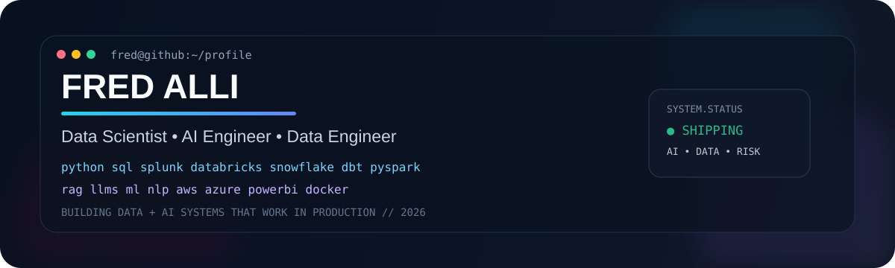
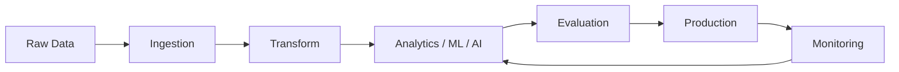

<div align="center">



<br/>

[](https://fredrickalli.com)
[](https://www.linkedin.com/in/fredrick-a-ab81922)
[](https://github.com/Falli007)


</div>

---

## `01 // PROFILE`

```text
fred@data-platform:~$ whoami

ROLE          Data Scientist • AI Engineer • Data Engineer
SPECIALISM    Applied ML • Risk Analytics • Generative AI • Data Platforms
LANGUAGES     Python • SQL • SPL
ANALYTICS     Splunk • Power BI • DAX
DATA          Databricks • Snowflake • dbt • PySpark • Delta Lake
CLOUD         AWS • S3 • Azure • Azure Blob Storage
AI / ML       Machine Learning • NLP • RAG • LLMs • Model Evaluation
ENGINEERING   Git • GitHub • Docker • REST APIs • CI/CD • VS Code
WORKFLOW      Ingest → Transform → Model → Evaluate → Deploy → Monitor
MISSION       Build systems that create measurable value in production.
```

I work across the full data lifecycle, from raw event and platform data through engineering, modelling, evaluation and production monitoring. My strongest work sits where **data science, fraud/risk analytics, AI engineering and modern data engineering** meet.

---

## `02 // 2026 FOCUS`

<table>
<tr>
<td width="50%" valign="top">

### 🤖 AI Engineering
RAG systems, LLM applications, evaluation harnesses, groundedness, observability and agent-style workflows.

</td>
<td width="50%" valign="top">

### 🏗️ Data Engineering
Lakehouse architecture, medallion pipelines, batch + streaming ingestion, transformation and production-quality data workflows.

</td>
</tr>
<tr>
<td width="50%" valign="top">

### 🛡️ Risk & Fraud Analytics
Detection logic, behavioural analytics, rule analysis, threshold testing and high-volume event investigation with Splunk.

</td>
<td width="50%" valign="top">

### 📊 Applied Data Science
Machine learning, NLP, time series, experimentation, model evaluation and decision-focused analytics.

</td>
</tr>
</table>

---

## `03 // CORE STACK`

<div align="center">

### Data Science & Analytics


### Modern Data Engineering


### Cloud, Storage & Engineering


### AI, ML & GenAI


</div>

---

## `04 // SELECTED BUILDS`

<table>
<tr>
<td width="50%" valign="top">

### 🧠 [GenAI PDF RAG Chatbot](https://github.com/Falli007/genai-pdf-rag-chatbot)
Production-minded retrieval augmented generation application.

`Python` `RAG` `LLMs` `Retrieval`

</td>
<td width="50%" valign="top">

### 🧪 [Evaluation Harness](https://github.com/Falli007/eval-harness)
Framework for testing and measuring AI system behaviour and quality.

`Python` `Evaluation` `AI Quality`

</td>
</tr>
<tr>
<td width="50%" valign="top">

### 📏 [RAG Model Evaluation](https://github.com/Falli007/RAGModel-Evaluation)
Evaluation workflows for retrieval and generation performance.

`RAG` `LLM Evaluation` `Metrics`

</td>
<td width="50%" valign="top">

### 🛡️ [Risk Advanced Modelling](https://github.com/Falli007/Risk-Advanced-Modelling)
Applied modelling and analytical workflows for risk-focused problems.

`Python` `Machine Learning` `Risk`

</td>
</tr>
<tr>
<td width="50%" valign="top">

### 🏗️ [Fred Data Platform](https://github.com/Falli007/fred-data-platform)
Modern data-platform engineering and architecture project.

`Data Engineering` `Cloud` `Pipelines`

</td>
<td width="50%" valign="top">

### 🔌 [Insurance Data Engineering API](https://github.com/Falli007/Insurance-Data-Engineer-RestAPI-Prpject)
API-driven ingestion and data engineering workflow.

`Python` `REST API` `Data Engineering`

</td>
</tr>
</table>

---

## `05 // HOW I THINK ABOUT SYSTEMS`



> **A model can be accurate and still be useless.**
>
> I care about the complete system: data quality, architecture, detection or model logic, evaluation, deployment, observability and whether the solution improves a real decision.

---

## `06 // GITHUB SIGNAL`

<div align="center">


<br/>


<br/>


</div>

---

## `07 // CURRENT DIRECTION`

```text
2026
├── Data Science
│   ├── Machine Learning
│   ├── Risk & Fraud Analytics
│   ├── NLP
│   └── Model Evaluation
├── AI Engineering
│   ├── RAG
│   ├── LLM Applications
│   ├── Evaluation & Groundedness
│   └── Production AI Systems
└── Data Engineering
    ├── Databricks / PySpark / Delta
    ├── Snowflake / dbt
    ├── AWS / S3
    └── Azure / Blob Storage
```

<div align="center">

### Build useful systems. Measure them. Improve them. Ship them.

**Data Science × AI Engineering × Data Engineering × Risk Analytics**

[Portfolio](https://fredrickalli.com) • [LinkedIn](https://www.linkedin.com/in/fredrick-a-ab81922) • [GitHub](https://github.com/Falli007)

</div>
